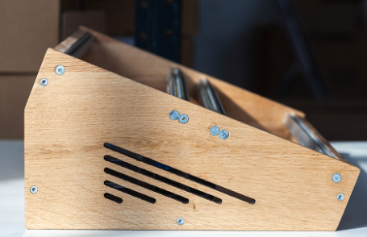

# Building a Eurorack case
This readme is just a rough documentation of my case build process. Hopefully you'll learn something from it!

## Dimensions

### Rails

The rails I got are not specifically made for Eurorack but I tested it with some blank panels and it works. I used a 1030 linear rail aluminum profile. I still don't have access to euro rails.

I used 2mm thick M3 square nuts and 6mm long screws. 6mm screws are a bit short so I got 8mm long ones.

### Length

I used this guide to help me decide what length I'll be using.
[https://synthracks.com/blog/eurorack-rails-diy-guide](https://synthracks.com/blog/eurorack-rails-diy-guide) 

The standard rail lengths are as follows:
- 60HP - 304.8mm
- 84HP - 426.72mm
- 104HP - 528.32mm
- 110HP - 558.8mm
- 126HP - 640.08mm
- 168HP - 853.44mm

I will go for a single row 84HP case. So that would be a length of 426.72mm. I would cut a bit more so it would give me some room for error. I will go for a length of 427mm.

I have to cut my rails. I have a total of 90cm to cut. I could only cut it into two so I went for 84HP. 

### Depth

- From the top of the rails it should measure about 10cm or more depending on your power supply

### Module height

I fit two blank modules on my rails and then measured the height between rails. I got 13.4 cm.

## Design Inspiration

I chose this design because I like how you can change the orientation.

### My design

I used google Sketchup to draft what I had in mind then I used Librecad to draw the side panel guides so I could transfer the template easily.

Initial drafts:

The design that I built is in the final design folder. A 1:1 scale pdf is provided so that you can cut your own side panels!

I would recommend using half inch or 10 - 15 mm thick plywood I used scrap wood. Make sure to screw in your rails first with some blank panels or modules in order to keep error low.

My workflow:

- I’ll cut the rails into two
- Try them out with blanks
- Measure the height
    - The height I measured was 13.4cm
    - Think of the wood panel design, either beveled view or not
- Design the side panels
- Then cut wood panels
- Build!

### Some resources

- [DIY eurorack case part 1](https://www.youtube.com/watch?v=6mVbi8B3usY)
