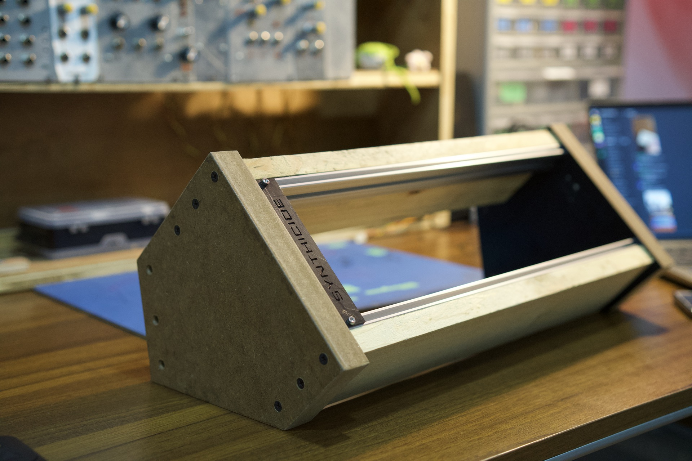

# Multi-Angle Eurorack 1-Row Case

A DIY single-row 84HP Eurorack case with **angle-adjustable side panels** — you can flip the side panels to change the case orientation (lay-flat, slight angle, steeper angle) depending on how you want to play it. Designed for plywood/wood construction with off-the-shelf aluminium rail.

This README is a build narrative — the same one Rex used when designing and cutting his own case.

## What you'll need

| Material | Spec | Notes |
|---|---|---|
| **Rail aluminium** | 1030 linear rail profile, ~427 mm cut to 84HP | Eurorack-specific rails work too; the 1030 profile is what Rex used because Euro-specific rail wasn't locally available |
| **Square nuts** | M3, 2 mm thick | Fit into the rail's slot; modules screw into them |
| **Screws** | M3, 8 mm long | 6 mm is technically minimum but a bit short; 8 mm gives confidence |
| **Wood panels** | Half-inch / 10–15 mm plywood | Rex used scrap wood. Thicker = more rigid; thinner = lighter |
| **Power** | (Not in this build) — bring your own ±12V bus board + PSU | See [EuroBusboard](https://github.com/DIYSynthMNL/EuroBusboard) for the bus board |

## Dimensions

### Rail length per HP count

Reference: [synthracks.com/blog/eurorack-rails-diy-guide](https://synthracks.com/blog/eurorack-rails-diy-guide).

| HP | Rail length (mm) |
|---|---|
| 60 | 304.8 |
| 84 | 426.72 |
| 104 | 528.32 |
| 110 | 558.8 |
| 126 | 640.08 |
| 168 | 853.44 |

Rex went with **84HP → 427 mm** (rounded up by ~0.3 mm to give some room for error when cutting). Started from a 90 cm stock length and cut it in two.

### Module fit clearance

- **Distance from the top of the rails to the back of the case**: at least 10 cm (depends on PSU depth)
- **Inter-rail height** (top-of-bottom-rail to bottom-of-top-rail): **13.4 cm** measured with two blank panels installed

## Design

Side panels are the headline feature — you can choose flat (rails parallel to the desk), or one of two angled positions. Inspired by commercial cases with the same "multi-angle" pattern.

**Tools used:**
- **Google Sketchup** — initial 3D drafts
- **LibreCAD** — side panel guide drafted to 1:1 scale, transferred onto wood as a cutting template

The design files in [`design-files/`](design-files/) include:
- **`84HP Eurorack Case - 20mm wood supports panel template - 1 to 1 scale.pdf`** — print on letter/A4 (multi-page) at 100% scale, tape together, transfer to wood
- **`84HP Eurorack Case - 20mm wood supports with dimensions - 1 to 1 scale.pdf`** — same template with dimensions called out, useful for verifying after print scaling
- **`Eurorack Case 1 Row 20mm - Built.dxf`** — DXF for CNC-cut side panels (LibreCAD source)

## Build workflow

1. **Cut the rail** to length (84HP = 427 mm)
2. **Test-fit blanks** in the cut rails to verify the module spacing
3. **Measure the inter-rail height** with blanks installed (~13.4 cm for 3U Eurorack)
4. **Design the side panels** — decide bevel angle / no bevel, account for the rail's flange thickness and the desired floor/back clearances
5. **Cut the wood panels** using the template
6. **Pre-fit the rails to the wood panels** with M3 + square nuts before final assembly
7. **Assemble** and test-fit a module

## Photos

Build photos: [`images/`](images/) (Built 1.jpg through Built 5.jpg) — process shots from cutting through to final assembly.

Hero shot: [`photos/front.jpg`](photos/front.jpg).

## Considerations for your own build

- **Rail tolerance.** Cheap aluminium profiles vary slightly in width; test-fit a module before committing to glue-up. The 1030 profile Rex used is wider than dedicated Eurorack rail, which means modules sit *slightly* further apart than spec — fine for blanks but check with your tightest-spaced modules.
- **Panel thickness.** Thinner plywood (< 10 mm) flexes when you lever modules out — annoying during build/swap. 15 mm gives confidence.
- **Bus board mounting.** The case design doesn't include bus board mounts. Plan space for the bus board (see [EuroBusboard](https://github.com/DIYSynthMNL/EuroBusboard)) and the PSU before final assembly.
- **Power inlet.** Add a hole for an IEC C13 inlet or a barrel jack for the PSU.
- **Front-of-case wiring.** With a 1-row case, the back is exposed — no need for chassis bus board mounting, but consider how to route the PSU output cable.

## License

This project is open hardware under the included [LICENSE](LICENSE). Build it, modify it, share photos of yours.

## References

- [synthracks.com / Eurorack rails DIY guide](https://synthracks.com/blog/eurorack-rails-diy-guide) — rail length reference and HP math
- [DIY eurorack case part 1 (YouTube)](https://www.youtube.com/watch?v=6mVbi8B3usY)
- Sibling repo: [EuroBusboard](https://github.com/DIYSynthMNL/EuroBusboard) — the bus board to install once the case is built

## Build status

- [x] Design files (PDF + DXF) in [`design-files/`](design-files/)
- [x] Built and tested — see [`images/`](images/)
- [x] Photos — see [`photos/`](photos/) and [`images/`](images/)
- [x] License — [LICENSE](LICENSE)
- [ ] BOM with sourcing links (rail, screws, square nuts, wood) — see [issue](../../issues)
- [ ] Templates for other HP sizes (60HP, 104HP, 168HP) — see [issue](../../issues)
